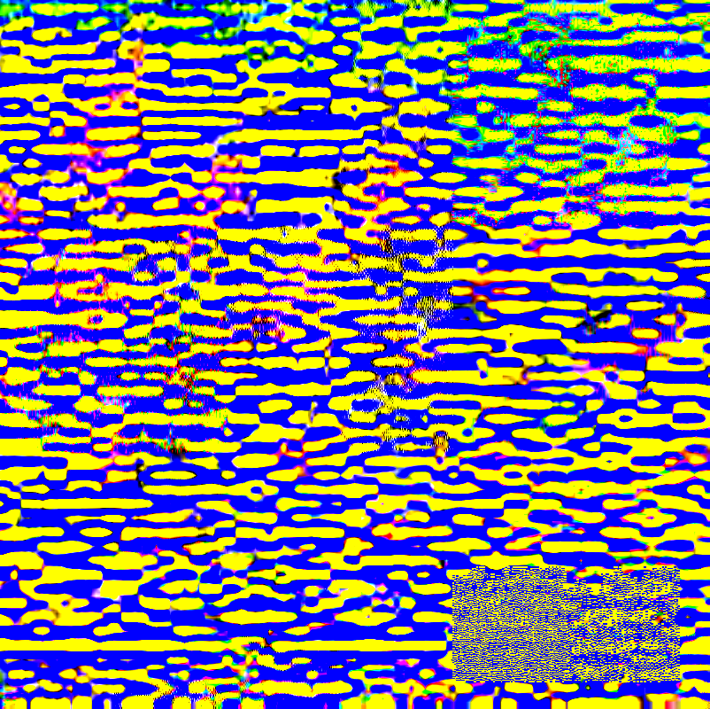

Recently someone I know convinced me to take part in a small amateur art exhibition, and since I don’t have any conventional artistic abilities, I thought it would be a good time to explore a topic I’ve been interested in for a while: [Glitch Art](https://en.wikipedia.org/wiki/Glitch_art), specifically what’s known as [databending](https://en.wikipedia.org/wiki/Databending). In this post I’ll introduce a tool I made to help do databending, talk about some of the tips and techniques that I learned along the way and share some of my favourite results.

<!--more-->

**If you just want to view an album of the images from this post, [click here](https://imgur.com/a/lh6NXGN)**

## glitch-tool – For messing files up

There are many ways to do databending, some as simple as opening an image in Notepad and copy-pasting data around. I knew I would have to do a lot of experimentation and look through many images to find some interesting results, so I decided early on to automate the process of messing up the image files. This resulted in me creating [glitch-tool](https://github.com/tobloef/glitch-tool), a simple Python script for reading and changing files in a multitude of ways. Using glitch-tool, you simply specify an input file, how the file should be changed and the amount and size of the changes, after which the tool will output a specified number of new, messed up images. You can read more about the tool and how to use it on the [GitHub repo](https://github.com/tobloef/glitch-tool). Using this tool allowed me to do rapid experimentation, as well as quickly generate a large number of images, which both ended up proving very useful when I was looking for interesting results.

Other than glitch-tool, I used three other programs, to both view and convert the image files. [IrfanView](https://www.irfanview.com/) was great for viewing all sorts of half-broken image files, that other viewers couldn’t handle, with the exception of PNG files, which the default Windows 10 image viewer handled much better than IrfanView, and [XnView MP](https://www.xnview.com/en/xnviewmp/) for [FLIF files](https://flif.info/), which IrfanView doesn’t support. I also use XnView MP for converting both the source images and the glitched results to whatever format I needed.

## File formats

Since different image formats encode data in different ways, making changes to an image file will result in different kinds of effect, depending on the format. Some formats break easily, others require large alterations to show any change at all. Some formats also break in very predictable ways, while other formats create unstable, unpredictable outcomes. I’ve generally found that the more complicated the compression algorithm used is, the crazier results you’ll get. Below you’ll find some examples of what kind of effect different file formats can give, along with a few notes on each.

### PNG
PNG files break very easily and very noticeably. I found messing with PNGs to yield two kinds of effects. The first is a black and white nosiness, with small coloured segments strewn in.

The other kind of effect is patches of vibrantly coloured squares, sometimes many interwoven ones. The more details an area of the image has, the more detailed the coloured patches will be. On a simple background, this effect can create stuff like simple coloured lines, and on more visually complex images, you’ll get a much more corrupted looking effect.

### JPG
Making just a single small change to a JPG file won’t do much, you’ll probably only see a slight discolouration somewhere in the image. To create interesting effects with JPGs, you either have to do many changes or bigger changes. I’ve found that moving around big chunks of the data is a good way to do this. The effects will usually be to both the image’s structure, where parts of the image gets shifted around, and the colour, where said parts also shift in their hue. On rare occasion, the image will almost look like it’s been highly compressed.

#### JPG Variations
Variations of the JPG format, like JPM, JP2 and JXR also each yield different effects. The effects mostly revolve around strange patterns, ranging from slightly opaque overlays, to abstract vibrant patterns completely covering the image. The first image in this post, one of my absolute favourites, was also created with a JP2 file.

### GIF
When I’m talking about GIFs here, I’m not talking about the animated ones, just images converted to the GIF format (although I might revisit animated GIFs later). With GIFS, you’ll almost always see parts of the image shifted to either the left or the right, but unlike other similar effects, shifted parts will be connected to each other, creating an analog-looking effect.

### FLIF
You may not have heard of FLIF, I certainly hadn’t until very recently. [The Free Lossless Image Format](https://flif.info/) (FLIF), is a new image format with a very high compression, which is great for us since high compression rates usually lead to interesting effects. Messing with a FLIF file, will often result in patterns of weird criss-crossing lines that vary greatly in glitchyness, ranging from cracked oil-panting to colourful grid-like patterns.

The awesome artist [Sabato Visconti](http://www.sabatobox.com/) also created some [interesting pieces](http://www.sabatobox.com/flif-databending-glitch-studies) using this file format.

### WEBP
The [WebP format](https://en.wikipedia.org/wiki/WebP) is another new image format with a very high compression rate. Unlike most of the other formats, WebP breaks in very predictable ways, always creating these blurry streaks of colour, that can sometimes make it look like the image is flowing off the screen. You can use this to your advantage, by picking source images that will fit this effect well. Since the effect always flows down and to the right, you can rotate and mirror the source images before glitching it, to control the flow of the effect.

### PSD
Glitches created with PSD files usually change around the position of parts of each colour channel. By varying the size of the data chunks you change, you can change the size of the moved segments.

## PCX
PCX files can create a effects similar to the GIF format, where segments of the image is shifted to one side or another, sometimes with changes to the colour.

### TGA
Messing with TGA files only seemed to create one kind of effect, a bit similar to some of the effects I’ve previously mentioned, where segments of the images gets shifted to the side. Unless you choose a source image with a fitting motif, the effect can be a bit boring on its own. You can also combine it with other effects for great results.

### TIF
TIF is another one of those formats that vary from version to version. I found two types of effects, an almost VHS-looking horizontal noise, and some thicker slightly transparent coloured lines.

### BMP
The last image format I’m going to mention, is the BMP format. Since this is just a simple bitmap, the effects won’t be very surprising. But using some of the additional modes from [glitch-tool](https://github.com/tobloef/glitch-tool), such as `reverse` or `move`, you can still create some decent results, especially if you choose a fitting motif or combine it with other effects, like I’ve done in the second picture below.

## Other tips
Before I conclude this post, I have a final few short tips:
* Be sure to export the resulting images as PNGs or similar when you want to share them, since different browsers and image viewers can display the actual glitched image differently.
* When saving glitched images as a PNG, many of them will end up having a transparent background, that may not be noticeable until you change viewer. You can fix this by adding a black background layer to the image in your favourite image editing software.
* Just like using different file formats will change the resulting effects, changing the compression settings for each file format, on the original source image, can also have a big impact.
* If you have a good image viewer, you can look through images very quickly, so don’t be afraid to look through a few thousand images like I ended up doing. Just don’t get stuck on a particular effect, if there aren’t any meaningful variations.

## Conclusion
This entire process, of creating the tool and experimenting with different file formats, only took a single day, and I think the results are pretty nice considering that. I got a lot of positive feedback showing some of these images off at small art event, and it was nice to see something different than the otherwise non-digital art there.

This was all a lot of fun and I encourage everyone to try this themselves, either using [glitch-tool](https://github.com/tobloef/glitch-tool) or their own tool. As mentioned at the beginning, there are also many ways to do databending, and these were just some of the techniques and lessons that I learned while doing this, so feel free to experiment and try other kinds of methods. If you make anything cool, have something to say about anything I wrote, or otherwise want to get in touch, you can either [tweet at me](https://twitter.com/tobloef) or shoot me an email at [tobloef@gmail.com](mailto:tobloef@gmail.com).

Thanks for reading. Good luck and happy glitching!