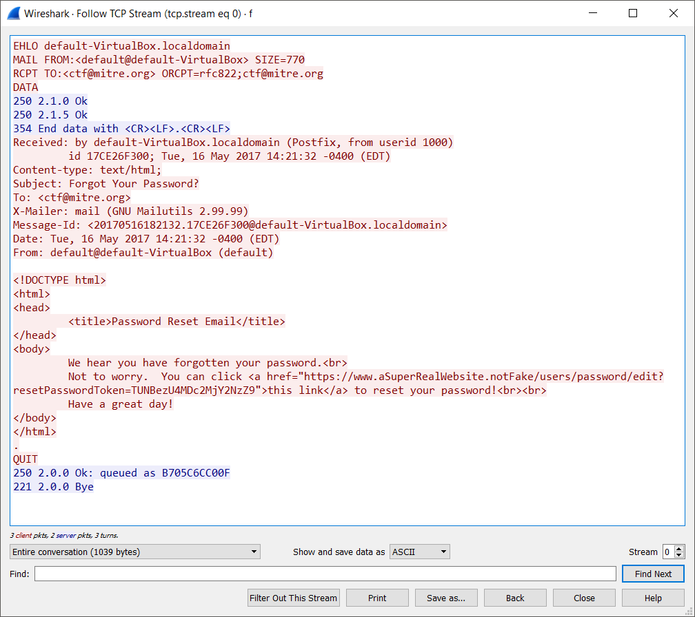
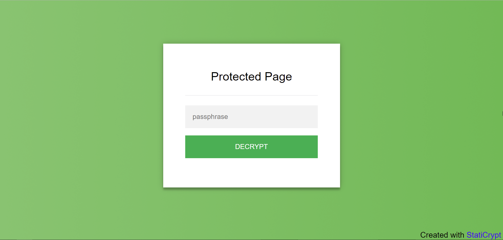
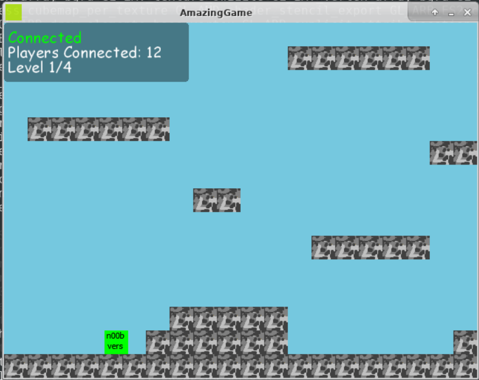
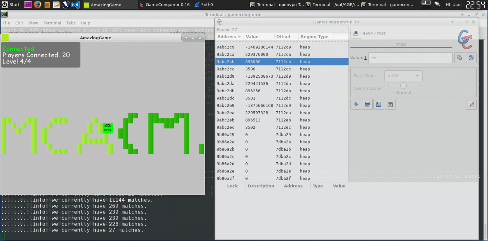

A couple of weeks ago I participated in the 24-hour 2017 MITRE STEM Cyber Challenge CTF, and now I've finally gotten around to setting up this blog and doing a writeup for the challenges I solved. Overall me and my teammate managed to get 1150 points, placing us at a shared 5th on the scoreboard.

Before starting the CTF I had decided to mostly focus on challenges in the forensics and miscellaneous categories, but I also ended up doing a web and a crypto challenge. The other two challenges my team did, Web 100 and Web 150, was solved by my teammate, so those solutions won't be posted here.

Unfortunately the challenge titles and descriptions are no longer available, and I didn't think to save them before the CTF ended, so I'll only be able to post the solutions, not the complete challenge descriptions.

## Forensics 50
[Click here to download the challenge .pcap file](/mitre-ctf-2017/forensics-50.pcap)

In this challenge we were given a .pcap file, which I opened up in Wireshark to take a closer look at. There are just five packets in the capture, seemingly a user receiving an email. To get a better overview of what was sent, I right-clicked on a packet and choose Follow -> TCP Stream.



We see what seems to be a password reset email for some non-existing website. The only thing of interest is the token from the password reset url: `TUNBezU4MDc2MjY2NzZ9`. Since it's just a bogus url and we don't have other relevant packets, it's safe to assume that the flag is hidden in the token. I tried decoding it as base64, which turned out to be correct, revealing the flag. Without the base64 padding it was harder to recognize, but I was lucky and got it on first try.

**Flag:** `MCA{5807626676}`

## Forensics 100
[Click here to download the challenge .zip file](/mitre-ctf-2017/forensics-100.zip)

In this challenge we were given a zip-fil. I unzipped it and took a look at its contents:

```bash
$ unzip forensics-100.zip
Archive:  forensics-100.zip
inflating: HDD_1.vhd
inflating: HDD_3.vhd
inflating: HDD_4.vhd
inflating: HDD_5.vhd
```

We can see that the .zip file contains 5 .vhd (Virtual Hard Disk) files. Let's do a quick binwalk on the files to see if they contain anything useful:

```bash
$ binwalk -e *.vhd

Scan Time:     2017-10-01 02:14:25
Signatures:    193
Target File:   HDD_1.vhd
MD5 Checksum:  8c02caf7e310120f8f51da5e92f97a80

DECIMAL         HEX             DESCRIPTION
--------------------------------------------------------------------------------------
1662464         0x195E00        PNG image, 1055 x 524, 8-bit/color RGB, non-interlaced
```

We can see that binwalk found a few embedded files, including a couple of .png images. Binwalk didn't extract the .png files, so let's specify that binwalk should extract the .png files:

```bash
$ binwalk -eD 'png image:png' *.vhd
```

Now we have the extracted image file, shown below:


**Flag:** `MCA{RA1D3rs_0f_the_L0sT_bits}`

## Web 50

In this challenge we were given a link that lead to a webpage with dog facts. At the bottom of the page we can see a message that seemingly contained the flag:

> Most doggos have 4 legs Many doggos have collars with their name or ID number on a tag. The most common tag number is, `MCA{C0PYING_1z_d@ng3r0us}`. no one really knows why this is such a popular number Doggos make good friends

But if we try to just copy the flag, something is messing with our clipboard and the copied piece of text won't actually be the flag. We can easily circumvent this by viewing the website's source and copying the flag from there.

**Flag:** `MCA{C0PYING_1z_d@ng3r0us}`

## Crypto 150
[Click here to download the challenge .html file](/mitre-ctf-2017/crypto-150.zip)



For this challenge we were given access to a static website with a password submission form. When the correct password was entered, the flag would be revealed. Since the logic of the website is purely client-side, I went ahead and downloaded the HTML file and opened it up in my text-editor of choice. We can immediately see a bit of CSS and a big chunk of minified JavaScript, a static crypto library called StaticJS. Other than that, the rest of the file is just a few lines of JavaScript code to decrypt a secret message with a password and display it on the website. Take a look:

```js
document.getElementById('staticrypt-form').addEventListener('submit', function(e) {
    e.preventDefault();

    var passphrase = document.getElementById('staticrypt-password').value,
        encryptedMsg = 'aef50f04292af2f4c063967bab63ba2a3c2804399e65ba3f61f061f924a9baf1U2FsdGVkX1+Uq+uFrMLmcEQ0YtYelIQnAmf7jpg75d2MwCUDhmtX2nW5Q3ccjXMEXK5rO50YWfd4LcFF3SlirE3nVckeQf5TNu8RSOzJSGS2hOEXNlz1/hLeyEcEtby0vVQTGXhMMFTdKial0/p+Kj17NbWPMLfy9WUYhHf3lAFuAg/1k4322yMV4y4NeIFPoNESRaBrbn2P2DcsSOZEDLfhh9WyXX323oyQqN/tBtNSAQ9P9QGQq1mCg1Fxidp70ep4ycx0fobAOLmxwmJfoUtcuZgn+XKaO78DTxErUcvJ8FTQt8O24t+ezSqPaWkUs/xT2vIJmZIxw6RSf6bSKdHwtP8Gxawk+7ZNS7tkdhcvg0li95lM83GUlMjKEYPJ9GFLD5k8CuqJdk6CO2ILCQMzhHuwHZLSmSR9Xyepak38n9qEBNiERGxWLU6T1GsvrQd3W07RQBgS1fWIOSU+vXrwlY0eUlPxKwwEOQEq/7DHFHecrPRv4eYWc14NnQAIOVjdbNgcyOse2BHCToo4UCxoxDu3+3e7buR2fVGj0qeolVL6fb8TKWGccDH72Z0NJxxskkgjZQBeEACxbmFwkdBKJjQZDIddTtXCLprLsKvtW8W9KQl/BfS723P8OJqkjoKxDKCsC4zGWvSPkE89Qg==',
        encryptedHMAC = encryptedMsg.substring(0, 64),
        encryptedHTML = encryptedMsg.substring(64),
        decryptedHMAC = CryptoJS.HmacSHA256(encryptedHTML, CryptoJS.SHA256(passphrase)).toString();

    if (decryptedHMAC !== encryptedHMAC) {
        alert('Bad passphrase !');
        return;
    }

    var plainHTML = CryptoJS.AES.decrypt(encryptedHTML, passphrase).toString(CryptoJS.enc.Utf8);

    document.write(plainHTML);
    document.close();
});
```

Based on the challenge's title and hint we know that there are probably emojis involved and that the password is only 2 characters, so the most obvious approach is to brute-force the password. Originally I thought the password would just be a single emoji, since emojis are represented by two bytes and basically count as two normal characters each, but this turned out to be false. The password was a combination of two emojis, but the approach was more or less the same either way.

I decided to create a quick Node.js script to brute-force the passphrase. CryptoJS is available as a NPM package, you can install it by running `npm install --save crypto-js` in the directory of the script. Below you can find the Node.js script I used to find the flag. I got the list of emojis from [emoji-list](https://github.com/Kikobeats/emojis-list/blob/master/dist/emojis-list.js). Also, make sure your terminal supports emojis!

```js
const CryptoJS = require("crypto-js");

const emojis = ["🀄","🃏","🅰","🅱","🅾","🅿","🆎","🆑","🆒","🆓","🆔","🆕","🆖","🆗","🆘","🆙","🆚","🇦🇨","🇦🇩","🇦🇪","🇦🇫","🇦🇬","🇦🇮","🇦🇱","🇦🇲","🇦🇴","🇦🇶","🇦🇷","🇦🇸","🇦🇹","🇦🇺","🇦🇼","🇦🇽","🇦🇿","🇦","🇧🇦","🇧🇧","🇧🇩","🇧🇪","🇧🇫","🇧🇬","🇧🇭","🇧🇮","🇧🇯","🇧🇱","🇧🇲","🇧🇳","🇧🇴","🇧🇶","🇧🇷","🇧🇸","🇧🇹","🇧🇻","🇧🇼","🇧🇾","🇧🇿","🇧","🇨🇦","🇨🇨","🇨🇩","🇨🇫","🇨🇬","🇨🇭","🇨🇮","🇨🇰","🇨🇱","🇨🇲","🇨🇳","🇨🇴","🇨🇵","🇨🇷","🇨🇺","🇨🇻","🇨🇼","🇨🇽","🇨🇾","🇨🇿","🇨","🇩🇪","🇩🇬","🇩🇯","🇩🇰","🇩🇲","🇩🇴","🇩🇿","🇩","🇪🇦","🇪🇨","🇪🇪","🇪🇬","🇪🇭","🇪🇷","🇪🇸","🇪🇹","🇪🇺","🇪","🇫🇮","🇫🇯","🇫🇰","🇫🇲","🇫🇴","🇫🇷","🇫","🇬🇦","🇬🇧","🇬🇩","🇬🇪","🇬🇫","🇬🇬","🇬🇭","🇬🇮","🇬🇱","🇬🇲","🇬🇳","🇬🇵","🇬🇶","🇬🇷","🇬🇸","🇬🇹","🇬🇺","🇬🇼","🇬🇾","🇬","🇭🇰","🇭🇲","🇭🇳","🇭🇷","🇭🇹","🇭🇺","🇭","🇮🇨","🇮🇩","🇮🇪","🇮🇱","🇮🇲","🇮🇳","🇮🇴","🇮🇶","🇮🇷","🇮🇸","🇮🇹","🇮","🇯🇪","🇯🇲","🇯🇴","🇯🇵","🇯","🇰🇪","🇰🇬","🇰🇭","🇰🇮","🇰🇲","🇰🇳","🇰🇵","🇰🇷","🇰🇼","🇰🇾","🇰🇿","🇰","🇱🇦","🇱🇧","🇱🇨","🇱🇮","🇱🇰","🇱🇷","🇱🇸","🇱🇹","🇱🇺","🇱🇻","🇱🇾","🇱","🇲🇦","🇲🇨","🇲🇩","🇲🇪","🇲🇫","🇲🇬","🇲🇭","🇲🇰","🇲🇱","🇲🇲","🇲🇳","🇲🇴","🇲🇵","🇲🇶","🇲🇷","🇲🇸","🇲🇹","🇲🇺","🇲🇻","🇲🇼","🇲🇽","🇲🇾","🇲🇿","🇲","🇳🇦","🇳🇨","🇳🇪","🇳🇫","🇳🇬","🇳🇮","🇳🇱","🇳🇴","🇳🇵","🇳🇷","🇳🇺","🇳🇿","🇳","🇴🇲","🇴","🇵🇦","🇵🇪","🇵🇫","🇵🇬","🇵🇭","🇵🇰","🇵🇱","🇵🇲","🇵🇳","🇵🇷","🇵🇸","🇵🇹","🇵🇼","🇵🇾","🇵","🇶🇦","🇶","🇷🇪","🇷🇴","🇷🇸","🇷🇺","🇷🇼","🇷","🇸🇦","🇸🇧","🇸🇨","🇸🇩","🇸🇪","🇸🇬","🇸🇭","🇸🇮","🇸🇯","🇸🇰","🇸🇱","🇸🇲","🇸🇳","🇸🇴","🇸🇷","🇸🇸","🇸🇹","🇸🇻","🇸🇽","🇸🇾","🇸🇿","🇸","🇹🇦","🇹🇨","🇹🇩","🇹🇫","🇹🇬","🇹🇭","🇹🇯","🇹🇰","🇹🇱","🇹🇲","🇹🇳","🇹🇴","🇹🇷","🇹🇹","🇹🇻","🇹🇼","🇹🇿","🇹","🇺🇦","🇺🇬","🇺🇲","🇺🇳","🇺🇸","🇺🇾","🇺🇿","🇺","🇻🇦","🇻🇨","🇻🇪","🇻🇬","🇻🇮","🇻🇳","🇻🇺","🇻","🇼🇫","🇼🇸","🇼","🇽🇰","🇽","🇾🇪","🇾🇹","🇾","🇿🇦","🇿🇲","🇿🇼","🇿","🈁","🈂","🈚","🈯","🈲","🈳","🈴","🈵","🈶","🈷","🈸","🈹","🈺","🉐","🉑","🌀","🌁","🌂","🌃","🌄","🌅","🌆","🌇","🌈","🌉","🌊","🌋","🌌","🌍","🌎","🌏","🌐","🌑","🌒","🌓","🌔","🌕","🌖","🌗","🌘","🌙","🌚","🌛","🌜","🌝","🌞","🌟","🌠","🌡","🌤","🌥","🌦","🌧","🌨","🌩","🌪","🌫","🌬","🌭","🌮","🌯","🌰","🌱","🌲","🌳","🌴","🌵","🌶","🌷","🌸","🌹","🌺","🌻","🌼","🌽","🌾","🌿","🍀","🍁","🍂","🍃","🍄","🍅","🍆","🍇","🍈","🍉","🍊","🍋","🍌","🍍","🍎","🍏","🍐","🍑","🍒","🍓","🍔","🍕","🍖","🍗","🍘","🍙","🍚","🍛","🍜","🍝","🍞","🍟","🍠","🍡","🍢","🍣","🍤","🍥","🍦","🍧","🍨","🍩","🍪","🍫","🍬","🍭","🍮","🍯","🍰","🍱","🍲","🍳","🍴","🍵","🍶","🍷","🍸","🍹","🍺","🍻","🍼","🍽","🍾","🍿","🎀","🎁","🎂","🎃","🎄","🎅🏻","🎅🏼","🎅🏽","🎅🏾","🎅🏿","🎅","🎆","🎇","🎈","🎉","🎊","🎋","🎌","🎍","🎎","🎏","🎐","🎑","🎒","🎓","🎖","🎗","🎙","🎚","🎛","🎞","🎟","🎠","🎡","🎢","🎣","🎤","🎥","🎦","🎧","🎨","🎩","🎪","🎫","🎬","🎭","🎮","🎯","🎰","🎱","🎲","🎳","🎴","🎵","🎶","🎷","🎸","🎹","🎺","🎻","🎼","🎽","🎾","🎿","🏀","🏁","🏂🏻","🏂🏼","🏂🏽","🏂🏾","🏂🏿","🏂","🏃🏻‍♀️","🏃🏻‍♂️","🏃🏻","🏃🏼‍♀️","🏃🏼‍♂️","🏃🏼","🏃🏽‍♀️","🏃🏽‍♂️","🏃🏽","🏃🏾‍♀️","🏃🏾‍♂️","🏃🏾","🏃🏿‍♀️","🏃🏿‍♂️","🏃🏿","🏃‍♀️","🏃‍♂️","🏃","🏄🏻‍♀️","🏄🏻‍♂️","🏄🏻","🏄🏼‍♀️","🏄🏼‍♂️","🏄🏼","🏄🏽‍♀️","🏄🏽‍♂️","🏄🏽","🏄🏾‍♀️","🏄🏾‍♂️","🏄🏾","🏄🏿‍♀️","🏄🏿‍♂️","🏄🏿","🏄‍♀️","🏄‍♂️","🏄","🏅","🏆","🏇🏻","🏇🏼","🏇🏽","🏇🏾","🏇🏿","🏇","🏈","🏉","🏊🏻‍♀️","🏊🏻‍♂️","🏊🏻","🏊🏼‍♀️","🏊🏼‍♂️","🏊🏼","🏊🏽‍♀️","🏊🏽‍♂️","🏊🏽","🏊🏾‍♀️","🏊🏾‍♂️","🏊🏾","🏊🏿‍♀️","🏊🏿‍♂️","🏊🏿","🏊‍♀️","🏊‍♂️","🏊","🏋🏻‍♀️","🏋🏻‍♂️","🏋🏻","🏋🏼‍♀️","🏋🏼‍♂️","🏋🏼","🏋🏽‍♀️","🏋🏽‍♂️","🏋🏽","🏋🏾‍♀️","🏋🏾‍♂️","🏋🏾","🏋🏿‍♀️","🏋🏿‍♂️","🏋🏿","🏋️‍♀️","🏋️‍♂️","🏋","🏌🏻‍♀️","🏌🏻‍♂️","🏌🏻","🏌🏼‍♀️","🏌🏼‍♂️","🏌🏼","🏌🏽‍♀️","🏌🏽‍♂️","🏌🏽","🏌🏾‍♀️","🏌🏾‍♂️","🏌🏾","🏌🏿‍♀️","🏌🏿‍♂️","🏌🏿","🏌️‍♀️","🏌️‍♂️","🏌","🏍","🏎","🏏","🏐","🏑","🏒","🏓","🏔","🏕","🏖","🏗","🏘","🏙","🏚","🏛","🏜","🏝","🏞","🏟","🏠","🏡","🏢","🏣","🏤","🏥","🏦","🏧","🏨","🏩","🏪","🏫","🏬","🏭","🏮","🏯","🏰","🏳️‍🌈","🏳","🏴‍☠️","🏴","🏵","🏷","🏸","🏹","🏺","🏻","🏼","🏽","🏾","🏿","🐀","🐁","🐂","🐃","🐄","🐅","🐆","🐇","🐈","🐉","🐊","🐋","🐌","🐍","🐎","🐏","🐐","🐑","🐒","🐓","🐔","🐕","🐖","🐗","🐘","🐙","🐚","🐛","🐜","🐝","🐞","🐟","🐠","🐡","🐢","🐣","🐤","🐥","🐦","🐧","🐨","🐩","🐪","🐫","🐬","🐭","🐮","🐯","🐰","🐱","🐲","🐳","🐴","🐵","🐶","🐷","🐸","🐹","🐺","🐻","🐼","🐽","🐾","🐿","👀","👁‍🗨","👁","👂🏻","👂🏼","👂🏽","👂🏾","👂🏿","👂","👃🏻","👃🏼","👃🏽","👃🏾","👃🏿","👃","👄","👅","👆🏻","👆🏼","👆🏽","👆🏾","👆🏿","👆","👇🏻","👇🏼","👇🏽","👇🏾","👇🏿","👇","👈🏻","👈🏼","👈🏽","👈🏾","👈🏿","👈","👉🏻","👉🏼","👉🏽","👉🏾","👉🏿","👉","👊🏻","👊🏼","👊🏽","👊🏾","👊🏿","👊","👋🏻","👋🏼","👋🏽","👋🏾","👋🏿","👋","👌🏻","👌🏼","👌🏽","👌🏾","👌🏿","👌","👍🏻","👍🏼","👍🏽","👍🏾","👍🏿","👍","👎🏻","👎🏼","👎🏽","👎🏾","👎🏿","👎","👏🏻","👏🏼","👏🏽","👏🏾","👏🏿","👏","👐🏻","👐🏼","👐🏽","👐🏾","👐🏿","👐","👑","👒","👓","👔","👕","👖","👗","👘","👙","👚","👛","👜","👝","👞","👟","👠","👡","👢","👣","👤","👥","👦🏻","👦🏼","👦🏽","👦🏾","👦🏿","👦","👧🏻","👧🏼","👧🏽","👧🏾","👧🏿","👧","👨🏻‍🌾","👨🏻‍🍳","👨🏻‍🎓","👨🏻‍🎤","👨🏻‍🎨","👨🏻‍🏫","👨🏻‍🏭","👨🏻‍💻","👨🏻‍💼","👨🏻‍🔧","👨🏻‍🔬","👨🏻‍🚀","👨🏻‍🚒","👨🏻‍⚕️","👨🏻‍⚖️","👨🏻‍✈️","👨🏻","👨🏼‍🌾","👨🏼‍🍳","👨🏼‍🎓","👨🏼‍🎤","👨🏼‍🎨","👨🏼‍🏫","👨🏼‍🏭","👨🏼‍💻","👨🏼‍💼","👨🏼‍🔧","👨🏼‍🔬","👨🏼‍🚀","👨🏼‍🚒","👨🏼‍⚕️","👨🏼‍⚖️","👨🏼‍✈️","👨🏼","👨🏽‍🌾","👨🏽‍🍳","👨🏽‍🎓","👨🏽‍🎤","👨🏽‍🎨","👨🏽‍🏫","👨🏽‍🏭","👨🏽‍💻","👨🏽‍💼","👨🏽‍🔧","👨🏽‍🔬","👨🏽‍🚀","👨🏽‍🚒","👨🏽‍⚕️","👨🏽‍⚖️","👨🏽‍✈️","👨🏽","👨🏾‍🌾","👨🏾‍🍳","👨🏾‍🎓","👨🏾‍🎤","👨🏾‍🎨","👨🏾‍🏫","👨🏾‍🏭","👨🏾‍💻","👨🏾‍💼","👨🏾‍🔧","👨🏾‍🔬","👨🏾‍🚀","👨🏾‍🚒","👨🏾‍⚕️","👨🏾‍⚖️","👨🏾‍✈️","👨🏾","👨🏿‍🌾","👨🏿‍🍳","👨🏿‍🎓","👨🏿‍🎤","👨🏿‍🎨","👨🏿‍🏫","👨🏿‍🏭","👨🏿‍💻","👨🏿‍💼","👨🏿‍🔧","👨🏿‍🔬","👨🏿‍🚀","👨🏿‍🚒","👨🏿‍⚕️","👨🏿‍⚖️","👨🏿‍✈️","👨🏿","👨‍🌾","👨‍🍳","👨‍🎓","👨‍🎤","👨‍🎨","👨‍🏫","👨‍🏭","👨‍👦‍👦","👨‍👦","👨‍👧‍👦","👨‍👧‍👧","👨‍👧","👨‍👨‍👦‍👦","👨‍👨‍👦","👨‍👨‍👧‍👦","👨‍👨‍👧‍👧","👨‍👨‍👧","👨‍👩‍👦‍👦","👨‍👩‍👦","👨‍👩‍👧‍👦","👨‍👩‍👧‍👧","👨‍👩‍👧","👨‍💻","👨‍💼","👨‍🔧","👨‍🔬","👨‍🚀","👨‍🚒","👨‍⚕️","👨‍⚖️","👨‍✈️","👨‍❤️‍👨","👨‍❤️‍💋‍👨","👨","👩🏻‍🌾","👩🏻‍🍳","👩🏻‍🎓","👩🏻‍🎤","👩🏻‍🎨","👩🏻‍🏫","👩🏻‍🏭","👩🏻‍💻","👩🏻‍💼","👩🏻‍🔧","👩🏻‍🔬","👩🏻‍🚀","👩🏻‍🚒","👩🏻‍⚕️","👩🏻‍⚖️","👩🏻‍✈️","👩🏻","👩🏼‍🌾","👩🏼‍🍳","👩🏼‍🎓","👩🏼‍🎤","👩🏼‍🎨","👩🏼‍🏫","👩🏼‍🏭","👩🏼‍💻","👩🏼‍💼","👩🏼‍🔧","👩🏼‍🔬","👩🏼‍🚀","👩🏼‍🚒","👩🏼‍⚕️","👩🏼‍⚖️","👩🏼‍✈️","👩🏼","👩🏽‍🌾","👩🏽‍🍳","👩🏽‍🎓","👩🏽‍🎤","👩🏽‍🎨","👩🏽‍🏫","👩🏽‍🏭","👩🏽‍💻","👩🏽‍💼","👩🏽‍🔧","👩🏽‍🔬","👩🏽‍🚀","👩🏽‍🚒","👩🏽‍⚕️","👩🏽‍⚖️","👩🏽‍✈️","👩🏽","👩🏾‍🌾","👩🏾‍🍳","👩🏾‍🎓","👩🏾‍🎤","👩🏾‍🎨","👩🏾‍🏫","👩🏾‍🏭","👩🏾‍💻","👩🏾‍💼","👩🏾‍🔧","👩🏾‍🔬","👩🏾‍🚀","👩🏾‍🚒","👩🏾‍⚕️","👩🏾‍⚖️","👩🏾‍✈️","👩🏾","👩🏿‍🌾","👩🏿‍🍳","👩🏿‍🎓","👩🏿‍🎤","👩🏿‍🎨","👩🏿‍🏫","👩🏿‍🏭","👩🏿‍💻","👩🏿‍💼","👩🏿‍🔧","👩🏿‍🔬","👩🏿‍🚀","👩🏿‍🚒","👩🏿‍⚕️","👩🏿‍⚖️","👩🏿‍✈️","👩🏿","👩‍🌾","👩‍🍳","👩‍🎓","👩‍🎤","👩‍🎨","👩‍🏫","👩‍🏭","👩‍👦‍👦","👩‍👦","👩‍👧‍👦","👩‍👧‍👧","👩‍👧","👩‍👩‍👦‍👦","👩‍👩‍👦","👩‍👩‍👧‍👦","👩‍👩‍👧‍👧","👩‍👩‍👧","👩‍💻","👩‍💼","👩‍🔧","👩‍🔬","👩‍🚀","👩‍🚒","👩‍⚕️","👩‍⚖️","👩‍✈️","👩‍❤️‍👨","👩‍❤️‍👩","👩‍❤️‍💋‍👨","👩‍❤️‍💋‍👩","👩","👪🏻","👪🏼","👪🏽","👪🏾","👪🏿","👪","👫🏻","👫🏼","👫🏽","👫🏾","👫🏿","👫","👬🏻","👬🏼","👬🏽","👬🏾","👬🏿","👬","👭🏻","👭🏼","👭🏽","👭🏾","👭🏿","👭","👮🏻‍♀️","👮🏻‍♂️","👮🏻","👮🏼‍♀️","👮🏼‍♂️","👮🏼","👮🏽‍♀️","👮🏽‍♂️","👮🏽","👮🏾‍♀️","👮🏾‍♂️","👮🏾","👮🏿‍♀️","👮🏿‍♂️","👮🏿","👮‍♀️","👮‍♂️","👮","👯🏻‍♀️","👯🏻‍♂️","👯🏻","👯🏼‍♀️","👯🏼‍♂️","👯🏼","👯🏽‍♀️","👯🏽‍♂️","👯🏽","👯🏾‍♀️","👯🏾‍♂️","👯🏾","👯🏿‍♀️","👯🏿‍♂️","👯🏿","👯‍♀️","👯‍♂️","👯","👰🏻","👰🏼","👰🏽","👰🏾","👰🏿","👰","👱🏻‍♀️","👱🏻‍♂️","👱🏻","👱🏼‍♀️","👱🏼‍♂️","👱🏼","👱🏽‍♀️","👱🏽‍♂️","👱🏽","👱🏾‍♀️","👱🏾‍♂️","👱🏾","👱🏿‍♀️","👱🏿‍♂️","👱🏿","👱‍♀️","👱‍♂️","👱","👲🏻","👲🏼","👲🏽","👲🏾","👲🏿","👲","👳🏻‍♀️","👳🏻‍♂️","👳🏻","👳🏼‍♀️","👳🏼‍♂️","👳🏼","👳🏽‍♀️","👳🏽‍♂️","👳🏽","👳🏾‍♀️","👳🏾‍♂️","👳🏾","👳🏿‍♀️","👳🏿‍♂️","👳🏿","👳‍♀️","👳‍♂️","👳","👴🏻","👴🏼","👴🏽","👴🏾","👴🏿","👴","👵🏻","👵🏼","👵🏽","👵🏾","👵🏿","👵","👶🏻","👶🏼","👶🏽","👶🏾","👶🏿","👶","👷🏻‍♀️","👷🏻‍♂️","👷🏻","👷🏼‍♀️","👷🏼‍♂️","👷🏼","👷🏽‍♀️","👷🏽‍♂️","👷🏽","👷🏾‍♀️","👷🏾‍♂️","👷🏾","👷🏿‍♀️","👷🏿‍♂️","👷🏿","👷‍♀️","👷‍♂️","👷","👸🏻","👸🏼","👸🏽","👸🏾","👸🏿","👸","👹","👺","👻","👼🏻","👼🏼","👼🏽","👼🏾","👼🏿","👼","👽","👾","👿","💀","💁🏻‍♀️","💁🏻‍♂️","💁🏻","💁🏼‍♀️","💁🏼‍♂️","💁🏼","💁🏽‍♀️","💁🏽‍♂️","💁🏽","💁🏾‍♀️","💁🏾‍♂️","💁🏾","💁🏿‍♀️","💁🏿‍♂️","💁🏿","💁‍♀️","💁‍♂️","💁","💂🏻‍♀️","💂🏻‍♂️","💂🏻","💂🏼‍♀️","💂🏼‍♂️","💂🏼","💂🏽‍♀️","💂🏽‍♂️","💂🏽","💂🏾‍♀️","💂🏾‍♂️","💂🏾","💂🏿‍♀️","💂🏿‍♂️","💂🏿","💂‍♀️","💂‍♂️","💂","💃🏻","💃🏼","💃🏽","💃🏾","💃🏿","💃","💄","💅🏻","💅🏼","💅🏽","💅🏾","💅🏿","💅","💆🏻‍♀️","💆🏻‍♂️","💆🏻","💆🏼‍♀️","💆🏼‍♂️","💆🏼","💆🏽‍♀️","💆🏽‍♂️","💆🏽","💆🏾‍♀️","💆🏾‍♂️","💆🏾","💆🏿‍♀️","💆🏿‍♂️","💆🏿","💆‍♀️","💆‍♂️","💆","💇🏻‍♀️","💇🏻‍♂️","💇🏻","💇🏼‍♀️","💇🏼‍♂️","💇🏼","💇🏽‍♀️","💇🏽‍♂️","💇🏽","💇🏾‍♀️","💇🏾‍♂️","💇🏾","💇🏿‍♀️","💇🏿‍♂️","💇🏿","💇‍♀️","💇‍♂️","💇","💈","💉","💊","💋","💌","💍","💎","💏","💐","💑","💒","💓","💔","💕","💖","💗","💘","💙","💚","💛","💜","💝","💞","💟","💠","💡","💢","💣","💤","💥","💦","💧","💨","💩","💪🏻","💪🏼","💪🏽","💪🏾","💪🏿","💪","💫","💬","💭","💮","💯","💰","💱","💲","💳","💴","💵","💶","💷","💸","💹","💺","💻","💼","💽","💾","💿","📀","📁","📂","📃","📄","📅","📆","📇","📈","📉","📊","📋","📌","📍","📎","📏","📐","📑","📒","📓","📔","📕","📖","📗","📘","📙","📚","📛","📜","📝","📞","📟","📠","📡","📢","📣","📤","📥","📦","📧","📨","📩","📪","📫","📬","📭","📮","📯","📰","📱","📲","📳","📴","📵","📶","📷","📸","📹","📺","📻","📼","📽","📿","🔀","🔁","🔂","🔃","🔄","🔅","🔆","🔇","🔈","🔉","🔊","🔋","🔌","🔍","🔎","🔏","🔐","🔑","🔒","🔓","🔔","🔕","🔖","🔗","🔘","🔙","🔚","🔛","🔜","🔝","🔞","🔟","🔠","🔡","🔢","🔣","🔤","🔥","🔦","🔧","🔨","🔩","🔪","🔫","🔬","🔭","🔮","🔯","🔰","🔱","🔲","🔳","🔴","🔵","🔶","🔷","🔸","🔹","🔺","🔻","🔼","🔽","🕉","🕊","🕋","🕌","🕍","🕎","🕐","🕑","🕒","🕓","🕔","🕕","🕖","🕗","🕘","🕙","🕚","🕛","🕜","🕝","🕞","🕟","🕠","🕡","🕢","🕣","🕤","🕥","🕦","🕧","🕯","🕰","🕳","🕴🏻","🕴🏼","🕴🏽","🕴🏾","🕴🏿","🕴","🕵🏻‍♀️","🕵🏻‍♂️","🕵🏻","🕵🏼‍♀️","🕵🏼‍♂️","🕵🏼","🕵🏽‍♀️","🕵🏽‍♂️","🕵🏽","🕵🏾‍♀️","🕵🏾‍♂️","🕵🏾","🕵🏿‍♀️","🕵🏿‍♂️","🕵🏿","🕵️‍♀️","🕵️‍♂️","🕵","🕶","🕷","🕸","🕹","🕺🏻","🕺🏼","🕺🏽","🕺🏾","🕺🏿","🕺","🖇","🖊","🖋","🖌","🖍","🖐🏻","🖐🏼","🖐🏽","🖐🏾","🖐🏿","🖐","🖕🏻","🖕🏼","🖕🏽","🖕🏾","🖕🏿","🖕","🖖🏻","🖖🏼","🖖🏽","🖖🏾","🖖🏿","🖖","🖤","🖥","🖨","🖱","🖲","🖼","🗂","🗃","🗄","🗑","🗒","🗓","🗜","🗝","🗞","🗡","🗣","🗨","🗯","🗳","🗺","🗻","🗼","🗽","🗾","🗿","😀","😁","😂","😃","😄","😅","😆","😇","😈","😉","😊","😋","😌","😍","😎","😏","😐","😑","😒","😓","😔","😕","😖","😗","😘","😙","😚","😛","😜","😝","😞","😟","😠","😡","😢","😣","😤","😥","😦","😧","😨","😩","😪","😫","😬","😭","😮","😯","😰","😱","😲","😳","😴","😵","😶","😷","😸","😹","😺","😻","😼","😽","😾","😿","🙀","🙁","🙂","🙃","🙄","🙅🏻‍♀️","🙅🏻‍♂️","🙅🏻","🙅🏼‍♀️","🙅🏼‍♂️","🙅🏼","🙅🏽‍♀️","🙅🏽‍♂️","🙅🏽","🙅🏾‍♀️","🙅🏾‍♂️","🙅🏾","🙅🏿‍♀️","🙅🏿‍♂️","🙅🏿","🙅‍♀️","🙅‍♂️","🙅","🙆🏻‍♀️","🙆🏻‍♂️","🙆🏻","🙆🏼‍♀️","🙆🏼‍♂️","🙆🏼","🙆🏽‍♀️","🙆🏽‍♂️","🙆🏽","🙆🏾‍♀️","🙆🏾‍♂️","🙆🏾","🙆🏿‍♀️","🙆🏿‍♂️","🙆🏿","🙆‍♀️","🙆‍♂️","🙆","🙇🏻‍♀️","🙇🏻‍♂️","🙇🏻","🙇🏼‍♀️","🙇🏼‍♂️","🙇🏼","🙇🏽‍♀️","🙇🏽‍♂️","🙇🏽","🙇🏾‍♀️","🙇🏾‍♂️","🙇🏾","🙇🏿‍♀️","🙇🏿‍♂️","🙇🏿","🙇‍♀️","🙇‍♂️","🙇","🙈","🙉","🙊","🙋🏻‍♀️","🙋🏻‍♂️","🙋🏻","🙋🏼‍♀️","🙋🏼‍♂️","🙋🏼","🙋🏽‍♀️","🙋🏽‍♂️","🙋🏽","🙋🏾‍♀️","🙋🏾‍♂️","🙋🏾","🙋🏿‍♀️","🙋🏿‍♂️","🙋🏿","🙋‍♀️","🙋‍♂️","🙋","🙌🏻","🙌🏼","🙌🏽","🙌🏾","🙌🏿","🙌","🙍🏻‍♀️","🙍🏻‍♂️","🙍🏻","🙍🏼‍♀️","🙍🏼‍♂️","🙍🏼","🙍🏽‍♀️","🙍🏽‍♂️","🙍🏽","🙍🏾‍♀️","🙍🏾‍♂️","🙍🏾","🙍🏿‍♀️","🙍🏿‍♂️","🙍🏿","🙍‍♀️","🙍‍♂️","🙍","🙎🏻‍♀️","🙎🏻‍♂️","🙎🏻","🙎🏼‍♀️","🙎🏼‍♂️","🙎🏼","🙎🏽‍♀️","🙎🏽‍♂️","🙎🏽","🙎🏾‍♀️","🙎🏾‍♂️","🙎🏾","🙎🏿‍♀️","🙎🏿‍♂️","🙎🏿","🙎‍♀️","🙎‍♂️","🙎","🙏🏻","🙏🏼","🙏🏽","🙏🏾","🙏🏿","🙏","🚀","🚁","🚂","🚃","🚄","🚅","🚆","🚇","🚈","🚉","🚊","🚋","🚌","🚍","🚎","🚏","🚐","🚑","🚒","🚓","🚔","🚕","🚖","🚗","🚘","🚙","🚚","🚛","🚜","🚝","🚞","🚟","🚠","🚡","🚢","🚣🏻‍♀️","🚣🏻‍♂️","🚣🏻","🚣🏼‍♀️","🚣🏼‍♂️","🚣🏼","🚣🏽‍♀️","🚣🏽‍♂️","🚣🏽","🚣🏾‍♀️","🚣🏾‍♂️","🚣🏾","🚣🏿‍♀️","🚣🏿‍♂️","🚣🏿","🚣‍♀️","🚣‍♂️","🚣","🚤","🚥","🚦","🚧","🚨","🚩","🚪","🚫","🚬","🚭","🚮","🚯","🚰","🚱","🚲","🚳","🚴🏻‍♀️","🚴🏻‍♂️","🚴🏻","🚴🏼‍♀️","🚴🏼‍♂️","🚴🏼","🚴🏽‍♀️","🚴🏽‍♂️","🚴🏽","🚴🏾‍♀️","🚴🏾‍♂️","🚴🏾","🚴🏿‍♀️","🚴🏿‍♂️","🚴🏿","🚴‍♀️","🚴‍♂️","🚴","🚵🏻‍♀️","🚵🏻‍♂️","🚵🏻","🚵🏼‍♀️","🚵🏼‍♂️","🚵🏼","🚵🏽‍♀️","🚵🏽‍♂️","🚵🏽","🚵🏾‍♀️","🚵🏾‍♂️","🚵🏾","🚵🏿‍♀️","🚵🏿‍♂️","🚵🏿","🚵‍♀️","🚵‍♂️","🚵","🚶🏻‍♀️","🚶🏻‍♂️","🚶🏻","🚶🏼‍♀️","🚶🏼‍♂️","🚶🏼","🚶🏽‍♀️","🚶🏽‍♂️","🚶🏽","🚶🏾‍♀️","🚶🏾‍♂️","🚶🏾","🚶🏿‍♀️","🚶🏿‍♂️","🚶🏿","🚶‍♀️","🚶‍♂️","🚶","🚷","🚸","🚹","🚺","🚻","🚼","🚽","🚾","🚿","🛀🏻","🛀🏼","🛀🏽","🛀🏾","🛀🏿","🛀","🛁","🛂","🛃","🛄","🛅","🛋","🛌🏻","🛌🏼","🛌🏽","🛌🏾","🛌🏿","🛌","🛍","🛎","🛏","🛐","🛑","🛒","🛠","🛡","🛢","🛣","🛤","🛥","🛩","🛫","🛬","🛰","🛳","🛴","🛵","🛶","🤐","🤑","🤒","🤓","🤔","🤕","🤖","🤗","🤘🏻","🤘🏼","🤘🏽","🤘🏾","🤘🏿","🤘","🤙🏻","🤙🏼","🤙🏽","🤙🏾","🤙🏿","🤙","🤚🏻","🤚🏼","🤚🏽","🤚🏾","🤚🏿","🤚","🤛🏻","🤛🏼","🤛🏽","🤛🏾","🤛🏿","🤛","🤜🏻","🤜🏼","🤜🏽","🤜🏾","🤜🏿","🤜","🤝🏻","🤝🏼","🤝🏽","🤝🏾","🤝🏿","🤝","🤞🏻","🤞🏼","🤞🏽","🤞🏾","🤞🏿","🤞","🤠","🤡","🤢","🤣","🤤","🤥","🤦🏻‍♀️","🤦🏻‍♂️","🤦🏻","🤦🏼‍♀️","🤦🏼‍♂️","🤦🏼","🤦🏽‍♀️","🤦🏽‍♂️","🤦🏽","🤦🏾‍♀️","🤦🏾‍♂️","🤦🏾","🤦🏿‍♀️","🤦🏿‍♂️","🤦🏿","🤦‍♀️","🤦‍♂️","🤦","🤧","🤰🏻","🤰🏼","🤰🏽","🤰🏾","🤰🏿","🤰","🤳🏻","🤳🏼","🤳🏽","🤳🏾","🤳🏿","🤳","🤴🏻","🤴🏼","🤴🏽","🤴🏾","🤴🏿","🤴","🤵🏻","🤵🏼","🤵🏽","🤵🏾","🤵🏿","🤵","🤶🏻","🤶🏼","🤶🏽","🤶🏾","🤶🏿","🤶","🤷🏻‍♀️","🤷🏻‍♂️","🤷🏻","🤷🏼‍♀️","🤷🏼‍♂️","🤷🏼","🤷🏽‍♀️","🤷🏽‍♂️","🤷🏽","🤷🏾‍♀️","🤷🏾‍♂️","🤷🏾","🤷🏿‍♀️","🤷🏿‍♂️","🤷🏿","🤷‍♀️","🤷‍♂️","🤷","🤸🏻‍♀️","🤸🏻‍♂️","🤸🏻","🤸🏼‍♀️","🤸🏼‍♂️","🤸🏼","🤸🏽‍♀️","🤸🏽‍♂️","🤸🏽","🤸🏾‍♀️","🤸🏾‍♂️","🤸🏾","🤸🏿‍♀️","🤸🏿‍♂️","🤸🏿","🤸‍♀️","🤸‍♂️","🤸","🤹🏻‍♀️","🤹🏻‍♂️","🤹🏻","🤹🏼‍♀️","🤹🏼‍♂️","🤹🏼","🤹🏽‍♀️","🤹🏽‍♂️","🤹🏽","🤹🏾‍♀️","🤹🏾‍♂️","🤹🏾","🤹🏿‍♀️","🤹🏿‍♂️","🤹🏿","🤹‍♀️","🤹‍♂️","🤹","🤺","🤼🏻‍♀️","🤼🏻‍♂️","🤼🏻","🤼🏼‍♀️","🤼🏼‍♂️","🤼🏼","🤼🏽‍♀️","🤼🏽‍♂️","🤼🏽","🤼🏾‍♀️","🤼🏾‍♂️","🤼🏾","🤼🏿‍♀️","🤼🏿‍♂️","🤼🏿","🤼‍♀️","🤼‍♂️","🤼","🤽🏻‍♀️","🤽🏻‍♂️","🤽🏻","🤽🏼‍♀️","🤽🏼‍♂️","🤽🏼","🤽🏽‍♀️","🤽🏽‍♂️","🤽🏽","🤽🏾‍♀️","🤽🏾‍♂️","🤽🏾","🤽🏿‍♀️","🤽🏿‍♂️","🤽🏿","🤽‍♀️","🤽‍♂️","🤽","🤾🏻‍♀️","🤾🏻‍♂️","🤾🏻","🤾🏼‍♀️","🤾🏼‍♂️","🤾🏼","🤾🏽‍♀️","🤾🏽‍♂️","🤾🏽","🤾🏾‍♀️","🤾🏾‍♂️","🤾🏾","🤾🏿‍♀️","🤾🏿‍♂️","🤾🏿","🤾‍♀️","🤾‍♂️","🤾","🥀","🥁","🥂","🥃","🥄","🥅","🥇","🥈","🥉","🥊","🥋","🥐","🥑","🥒","🥓","🥔","🥕","🥖","🥗","🥘","🥙","🥚","🥛","🥜","🥝","🥞","🦀","🦁","🦂","🦃","🦄","🦅","🦆","🦇","🦈","🦉","🦊","🦋","🦌","🦍","🦎","🦏","🦐","🦑","🧀","‼","⁉","™","ℹ","↔","↕","↖","↗","↘","↙","↩","↪","#⃣","⌚","⌛","⌨","⏏","⏩","⏪","⏫","⏬","⏭","⏮","⏯","⏰","⏱","⏲","⏳","⏸","⏹","⏺","Ⓜ","▪","▫","▶","◀","◻","◼","◽","◾","☀","☁","☂","☃","☄","☎","☑","☔","☕","☘","☝🏻","☝🏼","☝🏽","☝🏾","☝🏿","☝","☠","☢","☣","☦","☪","☮","☯","☸","☹","☺","♀","♂","♈","♉","♊","♋","♌","♍","♎","♏","♐","♑","♒","♓","♠","♣","♥","♦","♨","♻","♿","⚒","⚓","⚔","⚕","⚖","⚗","⚙","⚛","⚜","⚠","⚡","⚪","⚫","⚰","⚱","⚽","⚾","⛄","⛅","⛈","⛎","⛏","⛑","⛓","⛔","⛩","⛪","⛰","⛱","⛲","⛳","⛴","⛵","⛷🏻","⛷🏼","⛷🏽","⛷🏾","⛷🏿","⛷","⛸","⛹🏻‍♀️","⛹🏻‍♂️","⛹🏻","⛹🏼‍♀️","⛹🏼‍♂️","⛹🏼","⛹🏽‍♀️","⛹🏽‍♂️","⛹🏽","⛹🏾‍♀️","⛹🏾‍♂️","⛹🏾","⛹🏿‍♀️","⛹🏿‍♂️","⛹🏿","⛹️‍♀️","⛹️‍♂️","⛹","⛺","⛽","✂","✅","✈","✉","✊🏻","✊🏼","✊🏽","✊🏾","✊🏿","✊","✋🏻","✋🏼","✋🏽","✋🏾","✋🏿","✋","✌🏻","✌🏼","✌🏽","✌🏾","✌🏿","✌","✍🏻","✍🏼","✍🏽","✍🏾","✍🏿","✍","✏","✒","✔","✖","✝","✡","✨","✳","✴","❄","❇","❌","❎","❓","❔","❕","❗","❣","❤","➕","➖","➗","➡","➰","➿","⤴","⤵","*⃣","⬅","⬆","⬇","⬛","⬜","⭐","⭕","0⃣","〰","〽","1⃣","2⃣","㊗","㊙","3⃣","4⃣","5⃣","6⃣","7⃣","8⃣","9⃣","©","®",""];

const encryptedMsg = 'aef50f04292af2f4c063967bab63ba2a3c2804399e65ba3f61f061f924a9baf1U2FsdGVkX1+Uq+uFrMLmcEQ0YtYelIQnAmf7jpg75d2MwCUDhmtX2nW5Q3ccjXMEXK5rO50YWfd4LcFF3SlirE3nVckeQf5TNu8RSOzJSGS2hOEXNlz1/hLeyEcEtby0vVQTGXhMMFTdKial0/p+Kj17NbWPMLfy9WUYhHf3lAFuAg/1k4322yMV4y4NeIFPoNESRaBrbn2P2DcsSOZEDLfhh9WyXX323oyQqN/tBtNSAQ9P9QGQq1mCg1Fxidp70ep4ycx0fobAOLmxwmJfoUtcuZgn+XKaO78DTxErUcvJ8FTQt8O24t+ezSqPaWkUs/xT2vIJmZIxw6RSf6bSKdHwtP8Gxawk+7ZNS7tkdhcvg0li95lM83GUlMjKEYPJ9GFLD5k8CuqJdk6CO2ILCQMzhHuwHZLSmSR9Xyepak38n9qEBNiERGxWLU6T1GsvrQd3W07RQBgS1fWIOSU+vXrwlY0eUlPxKwwEOQEq/7DHFHecrPRv4eYWc14NnQAIOVjdbNgcyOse2BHCToo4UCxoxDu3+3e7buR2fVGj0qeolVL6fb8TKWGccDH72Z0NJxxskkgjZQBeEACxbmFwkdBKJjQZDIddTtXCLprLsKvtW8W9KQl/BfS723P8OJqkjoKxDKCsC4zGWvSPkE89Qg==';

function crackPassphrase() {
    for (var i = 0; i < emojis.length; i++) {
        console.log(`${i}/${emojis.length}: ${emojis[i]}`);
        for (var j = 0; j < emojis.length; j++) {
            let passphrase = emojis[i] + emojis[j]
            let result = decryptMessage(encryptedMsg, passphrase);
            if (result != null) {
                console.log(`Success! The passphrase is: ${passphrase}`)
                console.log("Here's the decrypted HTML:");
                console.log(result);
                return;
            }
        }
    }
}

function decryptMessage(encryptedMessage, passphrase) {
    const encryptedHMAC = encryptedMessage.substring(0, 64);
    const encryptedHTML = encryptedMessage.substring(64);
    const decryptedHMAC = CryptoJS.HmacSHA256(encryptedHTML, CryptoJS.SHA256(passphrase)).toString();

    if (decryptedHMAC !== encryptedHMAC) {
        return null;
    }

    var plainHTML = CryptoJS.AES.decrypt(encryptedHTML, passphrase).toString(CryptoJS.enc.Utf8);
    return plainHTML;
}

crackPassphrase();
```

After running the script for a while, we can see that the password is ✈🍓, which is unfortunately happens to be one of the last combinations the script tries. After using the password to decrypt the message, we'll see some HTML containing the flag.

**Flag:** `MCA{🌯🍩🍪🍍🌶🥑🍦🍅🍿🥗🌭🥓🐳🐔🐁}`

## Grab Bag 150

In the end I didn't actually complete as many forensics challenges as I wanted, but I did complete a fair few grab bag challenges. The grab bag category is basically just a bunch of random challenges that doesn't fit any other category and they're usually pretty fun to do. In the first challenge we were provided with a little 2D platformer gamer. After running the installation script, we can see the game:



There are four levels in total, the first two are pretty standard platformer levels, but the third level is not just hard, it's impossible. There's a big impassable wall in the way, blocking the way to the end of the level. So, we'll cheat of course. After considering a few different approaches, I decided to see if I could edit the position of the player in the game's memory. On a Windows machine I would use Cheat Engine, but since I'm running the game on a Linux VM, I had to search for an alternative. I ended up using a tool called [scanmem](https://github.com/scanmem/scanmem) with the GameConqueror UI front-end, which is very similar to CheatEngine.

After searching for the two correct memory addresses for a while, the player's x and y coordinates, I finally found them and changed them so the player would be behind the wall. This got me to the final level, which contained the flag, as seen below:



You can see the first part of the flag `MCA{M` and after jumping a bit around the level I had the entire flag.

**Flag:** `MCA{MARIO_SUX!}`

## Grab Bag 200 (originally 100)

This challenge was originally the first challenge in the grab bag category, worth only 100 points. But it took around 20 hours before the first person (me!) solved it, and even then only two teams solved it in total, so the reward was raised.

In the end it turned out to be somewhat simple, but the solution didn't make a lot of sense (to me at least), which might explain why only a few people solved it.

[Download the .wav file here](/mitre-ctf-2017/grab-bag-100.wav)

For the challenge we were given a small .wav file. Playing it in Audacity we just hear some random noise, so there's probably something hidden in the data of the file. At this point I tried a lot of different things. Looking at the file in  hex editor, it definitely didn't look completely random, but the trouble was figuring out how to process the data to give a proper output. In the end I figured it out because of a hint form an admin, saying that the only tool we needed was Audacity. I experimented a bit around with different filters, but that didn't work either. I ended up getting an idea that I has to export the audio in a certain file format to view the flag. This turned out to be correct and by exporting the audio as a A-LAW encoded .wav file and then viewing this new file in a hex editor, I could see the flag.

**Flag:** `MCA{Be11er_th@n_UR_3ars}`

## Grab Bag 200

[Click here to download the challenge data file](/mitre-ctf-2017/grab-bag-200.txt)

This challenge was pretty cool and I want to give props to the makers of the challenge for their creativity. We were provided a text file containing a large list of numbers, all just around 270. According to the challenge description, this file was captured from a phone's gyroscope, so my immediate thought was that the small variations in numbers was the faint vibrations picked up by the gyroscope, which could hopefully be turned in to audio. I wrote a small script to do this:

```python
import numpy as np
from scipy.io.wavfile import write

with open("grab-bag-200.txt") as f:
    input = [int(line) for line in f]
    input = [(x - 270)/150 for x in input]
    raw = np.array(input)
    scaled = np.int16(raw/np.max(np.abs(raw)) * 32767)
    write('output.wav', 2500, scaled)
```

[Click here to listen to the output](/mitre-ctf-2017/grab-bag-200.wav)

It's a bit difficult to hear, but after cleaning the file up a bit in Audacity and straining my ears a lot, I finally managed to hear what the flag was.

**Flag:** `MCA{audio_is_fun_sometimes}`

## Conclusion
I really enjoyed participating in this CTF and the challenges were pretty creative. Shout out to the people in the STEM Discord server, fun times all around. Though we didn't win, I'm happy with ranking 5th on the scoreboard.

Also feel free to follow me on [Twitter](https://twitter.com/tobloef), where I sometimes post about my projects.

Thanks for reading!