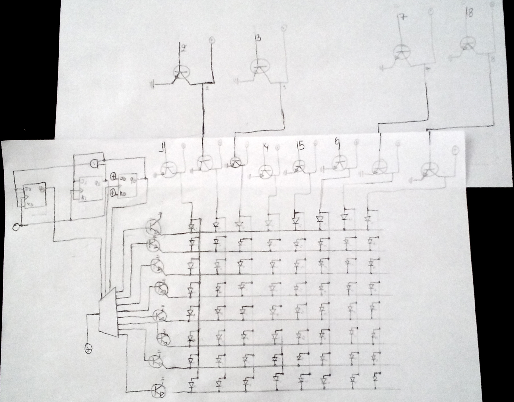
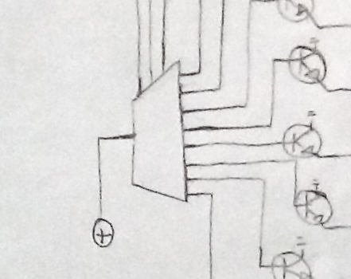
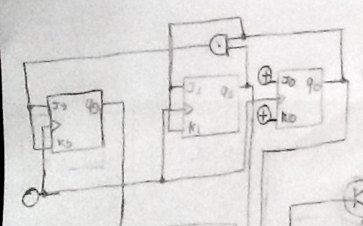

This weekend me and a couple of teammates took part in the 48 hour long Pwn2Win CTF 2017. It was a pretty challenging CTF, especially since there weren't a lot of challenges in the categories I usually do, but in the end we managed to place 10th on the scoreboard.

## Regex Baby

>Our team has gotten hands on this text and we know that it has been used by BloodSuckers Corp. as an admittance test for their applicants in the Counter Intelligence(CI) team, since these guys have an eye for pattern recognition! Get this achievement by helping the members of Rebellious Fingers that will soon try to infiltrate the CI team and will need this test's results.
>
>Pay close attention to the text in order to capture the sequence as it appears, understanding these instructions is also part of the challenge. The engine used is python2, everything is working as expected!
>
>P.S: In the challenge, wildcard refers exclusively to the asterisk ( * ).
>
>Server: nc 200.136.213.148 5000

This challenge was pretty straightforward, but it also turned out to be pretty difficult or at least time consuming. So even though golfing the regex was pretty fun, it probably wouldn't be worth it if the CTF had been shorter.

Each time I connected to the server I was given one of 8 challenges and after submitting the regex to solve the challenge the server sent a new challenge. After solving all 8 challenges the flag would be presented.

Throughout the challenge I used [Regex101](https://regex101.com/) to test my regex and then python's `re.findall()` to confirm that it worked.

```js
const { Socket } = require("net");
const { StringDecoder } = require("string_decoder");

const ip = "200.136.213.148";
const port = 5000;

const client = new Socket();
client.on("data", dataHandler);
client.connect(port, ip);

function dataHandler(data) {
    const dataStr = new StringDecoder("utf8").write(data).trim();
    if (dataStr == "" || dataStr == "\n") {
        return;
    }
    console.log(dataStr);
    if (!dataStr.startsWith("Type")) {
        return
    }
    if (dataStr.indexOf("CTF") > -1) {
        client.end()
        return;
    }
    switch (dataStr.substring(30,35)) {
        case "from ":
            dataToSend = "(.{7}).+(.{5})$";
            break;
        case "<know":
            dataToSend = "<.+[^.]>";
            break;
        case "FLY u":
            dataToSend = "(F)...+\\1..";
            break;
        case "the o":
            dataToSend = "(?P<a>..a)(?P=a)";
            break;
        case "(BONU":
            dataToSend = "CNN";
            break;
        case "the f":
            dataToSend = "[t,d] ([u,w,i]\\w{5,7}|[s,m]\\w{4})\\b";
            break;
        case "All \"":
            dataToSend = "\\x4f.{2}n";
            break;
        case "Chips":
            dataToSend = "([cC]....)\\n\\n";
            break;
        default:
            break;
    }
    console.log(dataToSend)
    client.write(dataToSend + "\n");
}
```

Running it, we see the script at work:

```bash
$ node baby_solver.js
Type the regex that capture: "Chips" and "code.", and it is only allowed the letter "c" (insensitive)", with max. "15" chars:
([cC]....)\n\n
Nice, next...
Type the regex that capture: "from "Drivin" until the end of phrase, without using any letter, single quotes or wildcards, and capturing "Drivin'" in a group, and "blue." in another", with max. "16" chars:
(.{7}).+(.{5})$
Nice, next...
Type the regex that capture: "<knowing the truth. >, without using "line break"", with max. "8" chars:
<.+[^.]>
Nice, next...
Type the regex that capture: "FLY until... Fly", without wildcards or the word "fly" and using backreference", with max. "14" chars:
(F)...+\1..
Nice, next...
Type the regex that capture: "(BONUS) What's the name of the big american television channel (current days) that matchs with this regex: .(.)\1", with max. "x" chars:
CNN
Nice, next...
Type the regex that capture: "the only word that repeat itself in the same word, using a group called "a" (and use it!), and the group expression must have a maximum of 3 chars, without using wildcards, plus signal, the word itself or letters different than [Pa]", with max. "16" chars:
(?P<a>..a)(?P=a)
Nice, next...
Type the regex that capture: "All "Open's", without using that word or [Ope-], and no more than one point", with max. "11" chars:
\x4f.{2}n
Nice, next...
Type the regex that capture: "the follow words: "unfolds", "within" (just one time), "makes", "inclines" and "shows" (just one time), without using hyphen, a sequence of letters (two or more) or the words itself", with max. "38" chars:
[t,d] ([u,w,i]\w{5,7}|[s,m]\w{4})\b
Nice, next...
CTF-BR{Counterintelligence_wants_you!}
```

**Flag:** `CTF-BR{Counterintelligence_wants_you!}`

## Botnet in the wild

> Our team got access to this malware, and we believe a modified version of it was used to infect a BloodSuckers server by an unidentified group. Analyze this malware, get access to the C&C and then pwn the server that's running it. Finally, find and exfiltrate any Important Files in the server and submit the flag in the format 'CTF-BR{md5sum-of-important-file}'

I didn't want to spin up a VM to run the malware in unless I had to, so I ran `strings botnetinthewild` and searched for anything interesting. One of the first things that I noticed was the line `NOTICE %s :Kaiten wa goraku`. After a quick Google search for the phrase, I found [this source file](/pwn2win-ctf-2017/kaiten.c), which the challenge's malware is based on.

This is what I learned from the source and the strings from earlier:
* The malware uses an IRC server as its C&C server.
* The IRC server is located at `bloodfuckers.mooo.info`
* The channel is `#bloodfuckers`
* The password for the channel is `TrespasserWillBeShot`

Before I tried to connect to the IRC server I did an nmap scan:

```bash
$ nmap bloodfuckers.mooo.info

Starting Nmap 7.01 ( https://nmap.org ) at 2017-10-22 04:20 UTC
Nmap scan report for bloodfuckers.mooo.info (45.77.73.247)
Host is up (0.032s latency).
Not shown: 996 closed ports
PORT     STATE SERVICE
22/tcp   open  ssh
80/tcp   open  http
443/tcp  open  https
2222/tcp open  EtherNetIP-1
```

I used the IRC client [WeeChat](https://weechat.org/) to connect to the server:

```bash
$ weechat

In WeeChat:
/server add mooo bloodfuckers.mooo.info/2222
/connect mooo
/join #bloodfuckers TrespasserWillBeShot
```

In the channel we can see a single other user called `CEPGHPC`. I didn't have permission to write in the channel, so I wrote a private message to the user using `/query CEPGHPC`. I knew a list of commands from the source, so I first of all tried `!HELP` to confirm that this user was actually the bot. This is the abbreviated output:

```
tobloef: !HELP
CEPGHPC: GET <http address> <save as>
= Downloads a file off the web and saves it onto the hd
CEPGHPC: IRC <command>
= Sends this command to the server
CEPGHPC: SH <command>
= Executes a command
CEPGHPC: AUTH
= Whitelisted domains to manage this knight
```

After trying the different commands I learned that `!GET` and `!IRC` was disabled in this version of the bot, but `!SH` wasn't. Let's try it:

```
tobloef: !SH
CEPGHPC: Sorry, you're not using a Secure Connection.
```

I knew from earlier that the server had port 443 (https) open, so I reconnected to the IRC using this port. I also had to set `moo.ssl = on` and `moo.ssl_verify = off` in `~/.weechat/irc.conf` to accept their valid certificate.

```
tobloef: !SH
CEPGHPC: Sorry, your vhost is not whitelisted, you are not authorized to send commands!
```

The `!AUTH` command shows the whitelisted domains:
```
tobloef: !AUTH
CEPGHPC: Whitelisted domains:
CEPGHPC: *.fearpenguins.com
```

I found out that you could register `fearpenguins.com` subdomains at [afraid.org](http://freedns.afraid.org/subdomain/), so I created the subdomain `tobloef.fearpenguins.com` and pointed it to a [DigitalOcean](https://m.do.co/c/a92261ae10d2) VPS. I choose DigitalOcean over my usual alternative [Vultr](https://www.vultr.com/?ref=7125087) because I needed to set up a PTR record to make reverse DNS work, something which Vultr doesn't support as far as I know. I renamed the droplet to `tobloef.fearpenguins.com` to automatically create the PTR records for reverse DNS, so that the IRC server will know that the droplet's domain is `tobloef.fearpenguins.com`.

At this point the bot had crashed and the author of the challenge was asleep, so I took the opportunity to get some sleep and when I woke up the bot was up again. This time the `!SH` command worked:

```
tobloef: !SH ls
CEPGHPC: bot.py
```

At this point I did a lot of testing to see what I could do on the server. I didn't have permissions to read the file `bot.py` and a lot of different commands were blocked by some kind of filter script. In the end I found the file `/media/disk0/bacup/Important_files.7z`, which was probably the file I needed to get hash of. I knew from testing that the string `md5sum` was blocked, so I needed to get the hash some other way. At this point my teammate found a way to get the MD5 hash using a python script which could be written to `/temp` and bypassing the filter on the string `python` by using multiple `echo` commands, but in the end we found a simpler solution.

```
tobloef: !SH openssl md5 /media/disk0/backup/Important_Files.7z
CEPGHPC: MD5(/media/disk0/backup/Important_Files.7z) =
CEPGHPC: 032e4bc3180d0836dad146277532dc88
```

**Flag:** `CTF-BR{032e4bc3180d0836dad146277532dc88}`

## Top Secret

>Molly was able to take pictures of a strange digital circuit sketch, along with an also strange message. All of these things were inside an envelope in a safe, which was labeled "Top Secret".
>
>We believe it might contain Butcher Corp's plans for the future, can you help us read the message?
>
>[Message.txt](/pwn2win-ctf-2017/Message.txt)
>
>[StrangeCircuit.jpg](/pwn2win-ctf-2017/StrangeCircuit.jpg)

In the `Message.txt` file linked above, we see 28 blocks of 16 rows of 1's and 0's in 9 columns numbered 0-8.

```
0 1 2 3 4 5 6 7 8

0 1 0 0 1 1 1 0 0
1 1 0 0 1 1 1 0 0
0 1 0 0 1 1 1 0 0
1 1 1 1 0 0 0 1 0
0 1 0 0 1 1 1 0 0
1 1 1 0 1 1 1 0 0
0 1 0 0 1 1 1 0 0
1 1 1 0 1 1 1 0 0
(continues)
```

We were also given an image of drawing an electrical circuit diagram. Now, before I begin, let me just say that I'm by no means an electronics expert, so if I've made some mistake in reading the diagram, please let me know. I've cropped the original image and increased the contrast for better viewing:



**You can skip this part if you aren't interested in the diagram and just want to see the solution, since it isn't strictly necessary so solve the challenge.**

Let's get an overview of the parts of this diagram. In the middle we have an 8x8 LED-matrix. Their power supplies are controlled by eight different inputs, at the top of the drawing, each input controls a column of LEDs, numbered 1-8. Each input has at least one NPN transistor before the LEDs, some of them two. These NPN transistors act as NOT gates.

Each row of the LEDs' ground pins also connects to a NPN transistors, to the left in the drawing, but these this time to another pin, so they don't work as NOT gates but instead let the LED rows connect to ground of the transistor receives a voltage.



Whether each transistor receives a voltages is controlled by a shift register, that's the trapezoid on the left. I'm not going to go into too much detail, you can find a more thorough explanation in [this video](https://www.youtube.com/watch?v=6fVbJbNPrEU), but here's a brief overview. A shift register shifts bits into its memory whenever the clock pin goes to high. Whether this bit is high or low, 1 or 0, is controlled by the serial pin. Once you've shifted the desired pins into memory, you can trigger the latch pin to turn the shift registers output pins on based on what's in memory.

We don't know which pin is which in the drawing, but we can probably assume that the 8 pins on the right of the shift register are the output pins, the single pin on the left is the clear pin and the three pins on the top are the clock, data and latch pin.



At the top left of the diagram we have three boxes with some inputs and outputs. These represent three JK flip flops, creating a synchronous counter. I assumed that the circle to the left was a 0, since I knew where the inputs for row 1-8 `Message.txt` were, but this turned out to be wrong. It turned out that these flip flops and the shift register weren't really important to solving the challenge, but I'll explain what these flip flops are doing anyway.

The JK flip flops have two inputs, a clock and two outputs (only one of them is used here). When the clock pin, marked by a small triangle, goes to high the output changes according to this truth table:

| J | K | Q (output) |
|---|---|------------|
| 0 | 0 | No change  |
| 0 | 1 | 0          |
| 1 | 0 | 1          |
| 1 | 1 | Toggles    |


Since the inputs (J and K) of the flip flop 0 to the right, are always high, its output Q will always toggle whenever it received a clock signal. The flip flop in the middle will toggle based on the right flip flops output, so it'll toggle every other clock signal. The left flip flops inputs are controlled by an AND gate with the output from the middle and right flip flops as inputs. This means that the left flip flop toggles every 4th toggle. So the flip flops outputs effectively work as a binary counter.

The pins aren't numbered, but the configuration that makes the most sense is the one where the right flip flop's output controls the shift registers clock, the middle flip flop's output goes to the shift register's data pin and the left flop flip's output controls the shift registers latch. This will produce an endless output of alternating 0's and 1's, similar to the one we see in column 0 in `Message.txt`.

After knowing how the circuit worked, I wrote a small script to simulate the LED matrix.

```python
# Read the file's lines into a list, but remove the first line
lines = [line.rstrip("\n").replace(" ", "") for line in open("Message.txt")][1:]
outputLines = [""] * 8
lineNum = 0
for line in lines:
    if len(line) > 0 and line[0] == "1":
        outputIndex = int((lineNum%17)/2-1)
        for j, char in enumerate(line[1:]):
            # If there's a double NOT gate
            if (j+1 in [2,3,7,8]):
                outputLines[outputIndex] += ("#" if char == "1" else " ")
            # If there's a single NOT gate
            else:
               outputLines[outputIndex] += ("#" if char != "1" else " ")
    lineNum += 1
with open("flag.txt", "w") as f:
    f.write("\n".join(outputLines))
```

Which outputs the file `flag.txt`:

```
######  ######  #####           #####   ####      ##    #         ##    ######    ##    ######  #####             ##    #    #  ####            #   #   ######  #       #               ####    #####   #     #  #####    ##   
#         ##    #               #    #  #   #    #      #        #  #   #        #  #     ##    #                #  #   ##   #  #   #           #  #      ##    #       #               #   #   #       ##   ## #           #  
#         ##    #        ####   #    #  #   #    #      #       #    #  #       #    #    ##    #               #    #  # #  #  #    #          # #       ##    #       #               #   #   #       # # # # #           #  
#         ##    #####    ####   #####   ####    #       #       #    #  #       #    #    ##    #####           #    #  #  # #  #    #          ##        ##    #       #               ####    #####   #  #  #  ####        # 
#         ##    #               #    #  ##       #      #        #  #   #       ######    ##    #               ######  #   ##  #   #           # #       ##    #       #               ##      #       #     #      #      #  
######    ##    #               #    #  # #      #      ######    ##    ######  #    #    ##    #               #    #  #    #  ####            #  #    ######  ######  ######          # #     #       #     #      #      #  
                #               #####   #  #      ##                            #    #          #####    ####   #    #                   ####   #   #                            ####   #  #    #####            #####    ##   
```

**Flag:** `CTF-BR{LOCATE_AND_KILL_REMS}`

---
**Thanks for reading. You can follow me on Twitter [@tobloef](https://twitter.com/tobloef) to get notified whenever I release a new writeup or some other interesting blog post.**
